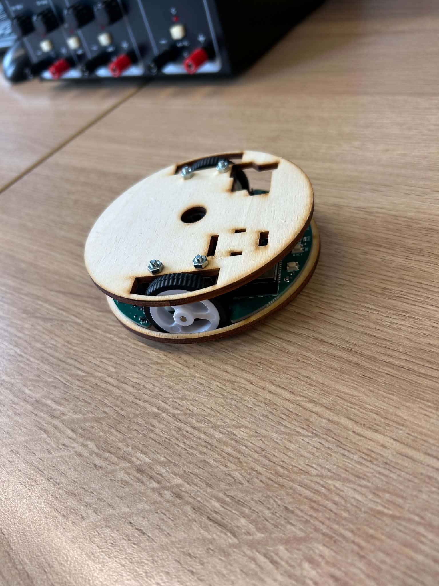
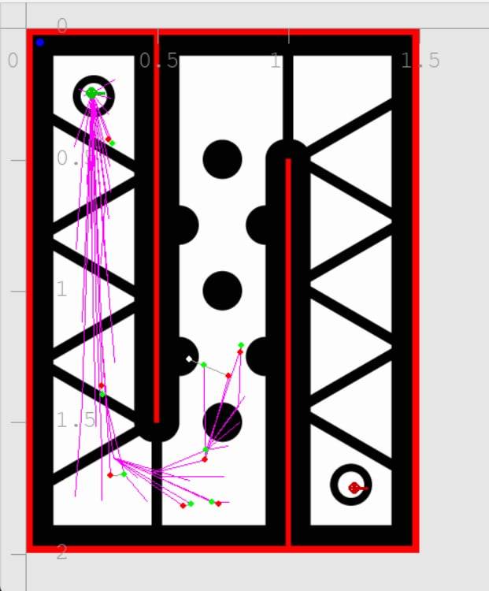

# differential-robot
Autonomous navigation for a 2-wheel differential robot.

## Description

This repo contains localization and navigation (path planning + control) for a 2-wheel differential drive robot (see picture below).



The robot consists mainly of:
- main computing unit (esp-based controller with built-in memory)
- four light sensors
- 2 DC motors with encoders (and wheels on them)

Besides functionality for a real robot, there is also a simulator provided for a virtual robot (see below).



## Content of the repository

- `lib/robot_discovery.py`: listen for broadcast intro packets and discover robots on the LAN.
- `lib/robot_control.py`: UDP control client with measurement handling.
- `lib/robot_sim.py`: UDP simulator compatible with `RobotControl`.
- `lib/visualiser.py`: Pygame-based 2D visualization helper.
- `lib/RRT/`: minimal RRT and RRT* implementations plus image-based primitives.
- `lib/poses/`: representation of a robot pose.
- `lib/kinematics_and_estimation/`: pose estimation.
- `lib/map/`: map object.
- `lib/measurements/`: handling robot measurements.
- `lib/resampling/`: particle resampling.
- `utils/`: small UDP utilities.
- `examples/`: demonstrations of individual components
- other utility files for type annotations and keyboard listeners.

## How to run

Run with cwd in `src`:

```bash
python -m autonomous_navigation
```

Note that there is a `CONFIGURATION` at the top of the file where you can configure the run.

## Dependencies

Core dependencies are listed in `requirements.txt`.
